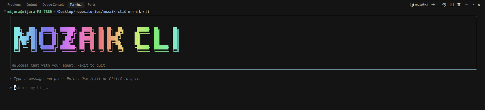
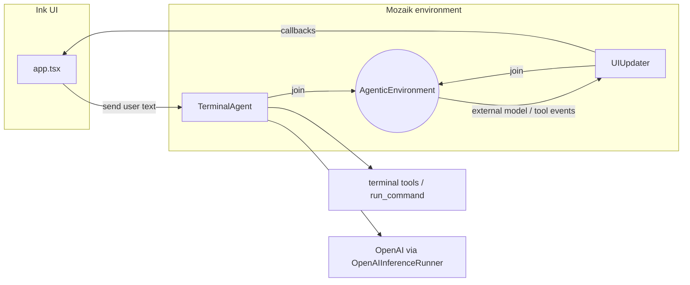

# Mozaik CLI

Reference terminal application built with **[Ink](https://github.com/vadimdemedes/ink)** that demonstrates how to use [**`@mozaik-ai/core`**](https://www.npmjs.com/package/@mozaik-ai/core): a TypeScript framework for **collaborative, event-driven agents**. Humans, agents, observers, and tools are all **participants** in the same **`AgenticEnvironment`**. Events (messages, function calls, model output) fan out to subscribers **without a central scheduler**, so you can compose reactive behaviors cleanly.

This repo is intentionally small: one agent that runs shell commands via tools, plus an observer that bridges Mozaik events into the React terminal UI.



---

## What this project showcases

| Mozaik concept                                                        | Where it lives in this repo                                                                                      |
| --------------------------------------------------------------------- | ---------------------------------------------------------------------------------------------------------------- |
| **`AgenticEnvironment`** — shared bus for participants                | [`source/session.ts`](source/session.ts): `environment.start()` after `join()`                                   |
| **`BaseAgentParticipant`** — inference + tool execution               | [`source/terminal/agent.ts`](source/terminal/agent.ts): `TerminalAgent`                                          |
| **`BaseObserverParticipant`** — react to _other_ participants’ events | [`source/ui-updater.ts`](source/ui-updater.ts): `UIUpdater` (`onExternalModelMessage`, `onExternalFunctionCall`) |
| **`ModelContext`** + **`GenerativeModel`** (`Gpt54`)                  | [`source/session.ts`](source/session.ts)                                                                         |
| **`OpenAIInferenceRunner`** + **`DefaultFunctionCallRunner`**         | [`source/session.ts`](source/session.ts)                                                                         |
| **Declarative `Tool` definitions**                                    | [`source/terminal/tools.ts`](source/terminal/tools.ts)                                                           |

The Ink UI does **not** call OpenAI directly. It calls `session.send(message)`, which forwards to the agent; the **`UIUpdater`** observer listens for assistant text and tool notifications on the environment and updates the UI through callbacks.

---

## Architecture



**Flow in plain language**

1. **`createAgentSession`** wires `DefaultFunctionCallRunner` (tools), `OpenAIInferenceRunner`, `ModelContext`, `Gpt54`, `TerminalAgent`, and `UIUpdater`, then starts the environment.
2. **`TerminalAgent`** extends **`BaseAgentParticipant`**. On user input it injects a short developer instruction plus a **`UserMessageItem`**, then **`runInference`**. When the model emits a **`FunctionCallItem`**, it records it in context and **`executeFunctionCall`**; when outputs return and pending calls drain, it **`runInference`** again (typical agent loop).
3. **`UIUpdater`** extends **`BaseObserverParticipant`**. It overrides **`onExternalModelMessage`** to surface assistant text to Ink, and **`onFunctionCall` / `onExternalFunctionCall`** to show which tool was invoked (the CLI agent and any parallel participant would both surface here).

This mirrors the mental model from the upstream Mozaik docs: producers emit events; observers and other agents react via **`onExternal*`** handlers.

---

## Prerequisites

- **Node.js** ≥ 16 (see [`package.json`](package.json) `engines`)
- **OpenAI API key** — the stack uses **`OpenAIInferenceRunner`** and **`Gpt54`** from `@mozaik-ai/core`

---

## Setup

1. Clone and install dependencies:

   ```bash
   npm install
   ```

2. Configure credentials. Create a **`.env`** in the project directory (or a parent directory — the CLI searches upward from `cwd` and from the install location):

   ```env
   OPENAI_API_KEY=sk-...
   ```

3. Build TypeScript:

   ```bash
   npm run build
   ```

---

## Usage

Run the compiled CLI:

```bash
node dist/cli.js
```

Or link globally after a build:

```bash
npm link
mozaik-cli
```

In the TUI: type a message and press **Enter**. Use **`/exit`**, **`/quit`**, **Escape**, or **Ctrl+C** to quit (Escape exits via Ink’s `useInput`).

When the model calls **`run_command`**, output is also printed to **`stdout`** from the tool implementation (see [`source/terminal/tools.ts`](source/terminal/tools.ts)), which is useful for debugging alongside the chat transcript.

---

## Project layout

| Path                                                                     | Role                                                 |
| ------------------------------------------------------------------------ | ---------------------------------------------------- |
| [`source/cli.tsx`](source/cli.tsx)                                       | Entry: `dotenv`, `meow` help, `render(<App />)`      |
| [`source/app.tsx`](source/app.tsx)                                       | Ink UI, local chat state, `createAgentSession` hooks |
| [`source/session.ts`](source/session.ts)                                 | Mozaik wiring: environment, agent, observer, model   |
| [`source/ui-updater.ts`](source/ui-updater.ts)                           | Observer participant → UI callbacks                  |
| [`source/terminal/agent.ts`](source/terminal/agent.ts)                   | Agent participant: context + inference loop          |
| [`source/terminal/tools.ts`](source/terminal/tools.ts)                   | `Tool[]` for `run_command`                           |
| [`source/terminal/terminal.ts`](source/terminal/terminal.ts)             | `spawn`-based command runner                         |
| [`source/terminal/command-result.ts`](source/terminal/command-result.ts) | Structured command result type                       |

---

## Development

| Script                      | Command         |
| --------------------------- | --------------- |
| Build                       | `npm run build` |
| Watch mode                  | `npm run dev`   |
| Lint / format check / tests | `npm test`      |

---

## Learning more

- **Package:** [`@mozaik-ai/core` on npm](https://www.npmjs.com/package/@mozaik-ai/core) — install with `npm install @mozaik-ai/core`.
- **Upstream README** (shipped with the package) documents **`Participant`** handlers (`onMessage`, `onFunctionCall`, `onExternalModelMessage`, …), **`BaseHumanParticipant`**, and reactive agent patterns — this CLI is a concrete subset focused on **one agent + one observer**.

To extend this demo: add another **`BaseAgentParticipant`** or **`BaseHumanParticipant`**, **`join`** it to the same **`AgenticEnvironment`**, and observe cross-agent traffic via **`onExternal*`** — that is the collaborative, event-driven composition model Mozaik is built for.

---

## License

MIT — see [`package.json`](package.json).
